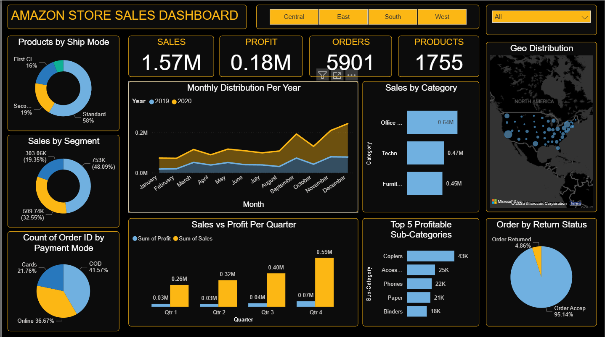

# Amazon-Store-Sales-Insights

Introduction  
This project is an **interactive Sales Dashboard** created using Power BI.  
It analyzes Amazon store sales data to track **sales, profit, orders, product performance, and customer behavior**.  
The goal was to practice data visualization and showcase business intelligence (BI) skills in a professional way.

Dataset Description  
- **Source:** Webinar-provided dataset  
- **Records:** 5,902 rows  
- **Columns:** 21 features  
- **Key Features:** Order ID, Date, Customer Name, Segment, Category, Sub-category, Ship Mode, Payment Mode, Sales, Profit, Quantity, Region, Return Status  

Dataset was already cleaned, so no preprocessing was required.

Tools Used  
- Microsoft **Power BI**  

Steps Followed  
1. Imported dataset into Power BI  
2. Explored dataset structure  
3. Built multiple charts, KPIs, and maps  
4. Designed dashboard with proper formatting and layout  

Dashboard Design & Visuals  
The dashboard includes:  
- **KPI Cards:** Sales, Profit, Orders, Products  
- **Donut Charts:** Products by Ship Mode, Sales by Segment, Orders by Payment Mode  
- **Line Chart:** Monthly Sales Distribution per Year  
- **Bar Charts:** Sales by Category, Sales vs Profit per Quarter, Top 5 Profitable Sub-Categories  
- **Map:** Geo Distribution of sales  
- **Pie Chart:** Order by Return Status  

Key Insights  
- **Consumer segment** generated the highest sales.  
- **Standard shipping mode** was most preferred.  
- **Office Supplies** category led in sales.  
- Sales peaked in **November–December**.  
- **United States** contributed most to sales.  
- **Copiers** were the most profitable sub-category.  
- Return rate was very low (**< 5%**).  

Outcome  
- Learned how to create dashboards in **Power BI**  
- Gained skills in choosing visuals & formatting  
- Understood how to represent KPIs clearly  
- Businesses can use this dashboard to track performance and make data-driven decisions  

Conclusion  
The Amazon Store Sales Dashboard provides an **interactive and insightful analysis** of store performance.  
It helps businesses optimize sales strategies, monitor profitability, and understand customer trends effectively.  

